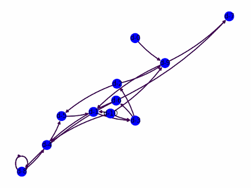
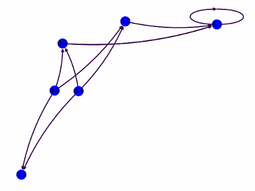
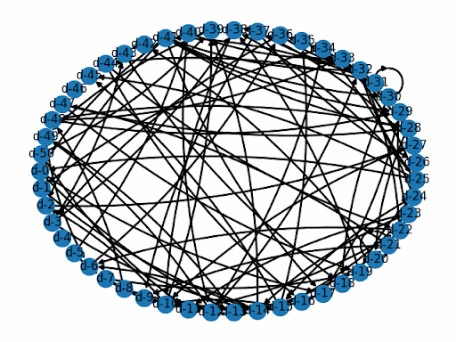
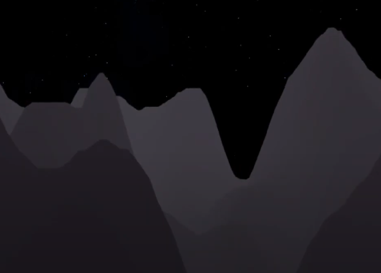
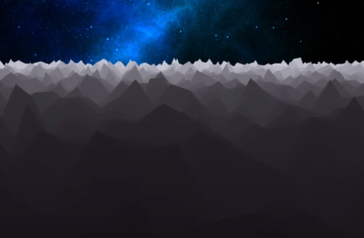

<h1 align="center"> Welcome to my page 👋 </h1>

<h4 align="center"> 
     🏮 <a href="https://lepronliner.github.io/portfolio/"> My Website 
     🏮 <a href="https://www.linkedin.com/in/zhizheng1/"> My LinkedIn 
     🏮 <a href="https://fzsav.itch.io"> My Itch.io 
     🏮
</h4>

### 🀄 Me

Hello stranger in the internet! My name is Zhi Zheng, I graduated from Rensselaer Polytechnic Institute with a bachelors degree in Games, Simulation, Arts & Sciences and Computer Science. Currently working on a master's degree in Computer Science at Rensselaer Polytechnic Institute. My research topic is sentiment and motivation analysis.

Experience in:

     
     
     
     
     
     
     
     
     
     
     
     
     
     

### 🪁 Hobbies

- 🧗 Bouldering [ [Vital Gym Brooklyn](https://www.vitalclimbinggym.com/brooklyn) ]
- 🎸Guitar [ Gear: Yamaha PAC112V Pacifica Red, Focusrite Scarlett solo, FL studio, no pedals ]
- 🚲 Cycling
- 🎲 Game Jams [ check my itch page/games ]
- 🎮 Video Games [ [Steam](https://steamcommunity.com/id/Lelelepro/) ]
- 🎯 Collegiate Esports Player
- 🃏 Magic The Gathering [ [Recent Tournament Placing](https://www.mtggoldfish.com/deck/5681347#paper) ]

### 🎨 Projects

#### [Project Protocol](https://github.com/MattLMerritt/protocol-protocol)
Project protocol is a website where protocols are displayed and explained through documentation and simulations.  

  
  
  

A .json file with configurations of a graph is provided or generated, and then sent to a simulator. The simulator runs and provides and output file of the graph as well as the timestamp of information of the protocol interactions, then outputs a .json to a graph visualizer. Then the results gets rendered into a .gif and displayed above. Certain graphs can be ordered or disordered, depending on the user configuration. 

#### 

#### [Terrain Generator OpenGL](https://github.com/LepronlineR/Terrain-Generator-OpenGL)
Generates a randomized terrain in OpenGL with tesselation. UI created and rendered with ImGUI.

  
  
  

The algorithm includes fractal noise, which includes custom parameters (frequency, octaves, lacunarity and persistence), as well as the Diamond-Square algorithm. Example on the left is generated with the diamond-square algorithm and the example on the right is generated with fractal noise.

     <iframe width="560" height="315" src="https://www.youtube.com/embed/jXcNmnmen_8" frameborder="1" allowfullscreen></iframe>

###

     

### ❄️ Games

#### Unannounced Project with Studio Rather Be Fishing

#### 

