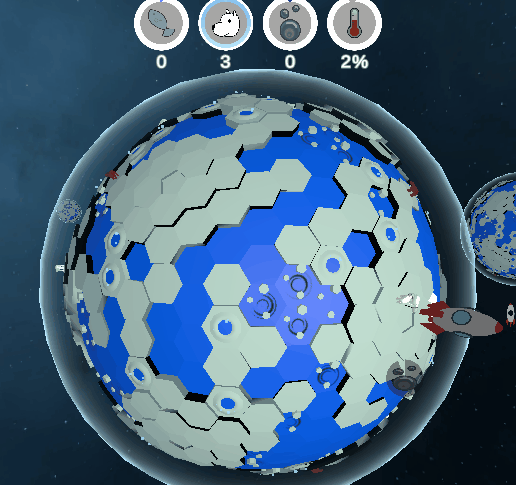
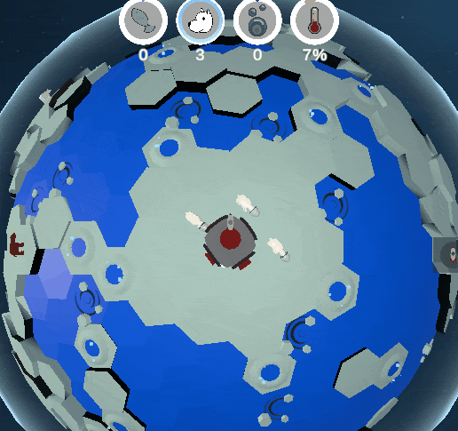
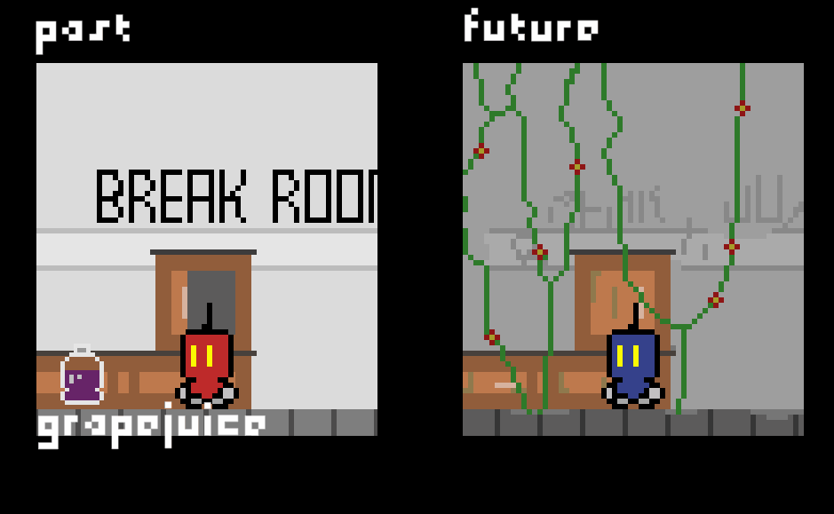

<h1 align="center"> Welcome to my page 👋 </h1>

<h4 align="center"> 
     🏮 <a href="https://lepronliner.github.io/portfolio/"> My Website 
     🏮 <a href="https://www.linkedin.com/in/zhizheng1/"> My LinkedIn 
     🏮 <a href="https://fzsav.itch.io"> My Itch.io 
     🏮
</h4>

# 🀄 Me

Hello stranger in the internet! My name is Zhi Zheng, I graduated from Rensselaer Polytechnic Institute with a bachelors degree in Games, Simulation, Arts & Sciences and Computer Science. Currently working on a master's degree in Computer Science at Rensselaer Polytechnic Institute. My research topic is sentiment and motivation analysis.

Experience in:

     
     
     
     
     
     
     
     
     
     
     
     
     
     

# 🪁 Hobbies

- 🧗 Bouldering [ [Vital Gym Brooklyn](https://www.vitalclimbinggym.com/brooklyn) ]
- 🎸Guitar [ Gear: Yamaha PAC112V Pacifica Red, Focusrite Scarlett solo, FL studio, no pedals ]
- 🚲 Cycling
- 🎲 Game Jams [ check my itch page/games ]
- 🎮 Video Games
- 🃏 Magic The Gathering [ [Recent Tournament Placing](https://www.mtggoldfish.com/deck/5681347#paper) ]

# 🎨 Projects

## [Project Protocol 🔌](https://github.com/MattLMerritt/protocol-protocol)
Project protocol is a website where protocols are displayed and explained through documentation and simulations.  

  
  
  

A .json file with configurations of a graph is provided or generated, and then sent to a simulator. The simulator runs and provides and output file of the graph as well as the timestamp of information of the protocol interactions, then outputs a .json to a graph visualizer. Then the results gets rendered into a .gif and displayed above. Certain graphs can be ordered or disordered, depending on the user configuration. 

## Force Directed Graph with Visualizing in the Campfire 🌎
The Campfire is a multidimensional visualization tool developed by the Rensselaer IDEA. In this project, a force directed graph is utilized in order to visualize data of neighbors. For instance, the amount of times two characters interacted with each other is recoreded as a weight of connection between the two characters. Then the graph applies a geometric constraint that forces the directed graph to an equilibrium. More explanation, implementation and results below.

  

## [Terrain Generator OpenGL ⛰️](https://github.com/LepronlineR/Terrain-Generator-OpenGL)
Generates a randomized terrain in OpenGL with tesselation. UI created and rendered with ImGUI. The algorithm includes fractal noise, which includes custom parameters (frequency, octaves, lacunarity and persistence), as well as the Diamond-Square algorithm.

  

## Misc

     

# ❄️ Games

## [Bear Rescue Force 🐻🚀](https://mishapozd.itch.io/bear-space-force)

A real time strategy game where you are able to control astronaut bears to gather resources in a melting planet. Before the planet melts, gather enough fish to recruit more bears in the planet and gather enough oil to leave the planet to rescue more bears in other planets. Travel to multiple planets in order to save more bears! This game is a participant in the Ludum dare game jam.

     
     

## [Pong Champs 🏓](https://puglic.itch.io/pongchamps)

A two player competitive game where both players control a omnidirectional ship that can shoot and parry a tennis ball across to hit the other player. The landscape of the game changes as the player gains an advantage. This game is developed for the RPI Arcade Game Jam and is playable in the RPI Game Development Club Arcade Machine.

     

## [Friends Across Time ⌛](https://chemist02.itch.io/friends-across-time)

A two player cooperative game where by sending items and controlling events in the past will change the future. Play this mind riveting time puzzle game with a friend next to you! This game is a participant in the RPI Game Jam.

     

## [Astral Chart 🔫🚀](https://corppet.itch.io/astral-chart)

A third person action adventure where the player is a mercenary ship taking missions through the galaxy. There are countless options of missions, dialogue, interactions between crewmates as well as a collage of weapons to choose from.

     
     

## [Inflection 📖😮](https://corppet.itch.io/astral-chart)

A first person mystery game where the player has to investigate a death of a person that he is convicted the murder of. The game utilizes microsoft voice detection in order for the player to ask questions to the witness and a machine learning algorithm in order to process the voice and determine the inflection of the voice, determining the resulting response. 

     
     

## Unannounced Project with Studio Rather Be Fishing 🎣

